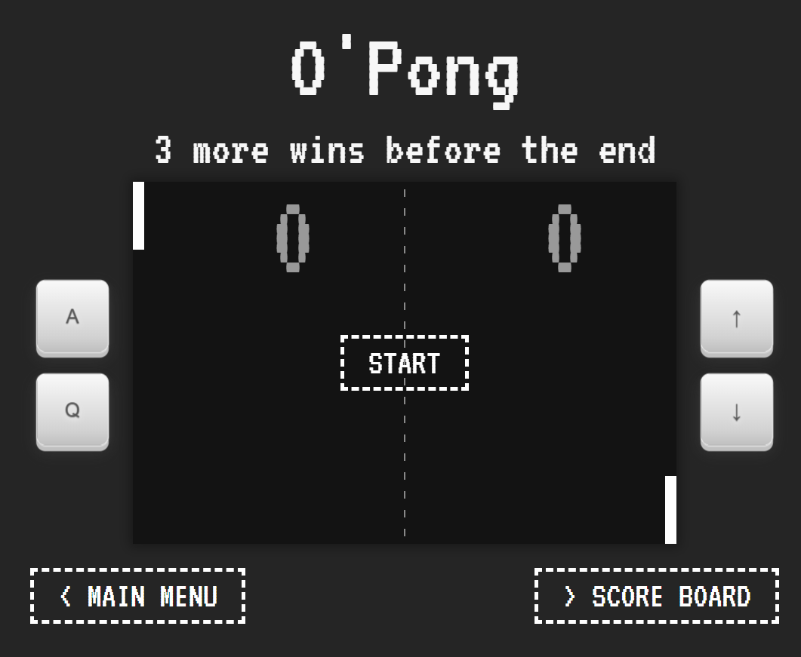

# O'Pong Front

> :warning: **N'oublie pas d'aller faire un tour sur le [wiki du back](https://github.com/slampazona/oclock-pong/wiki), il y a pas mal d'informations importantes sur le fonctionnement global et les échanges entre front et back**



## :sunny: Pré-requis

Le front de O'pong, fonctionne correctement seul, cependant il récupère ses données à travers un API en Node.JS. Il est disponible à [cette adresse](https://github.com/slampazona/oclock-pong). Réfère toi au [README.md](https://github.com/slampazona/oclock-pong#readme) pour l'installer sur ta machine.

Il faudra créer un fichier de configuration `.env` dans le dossier front-react, en prenant comme exemple le fichier `.env.example`.
Il y a la possibilité d'avoir plusieurs fichiers `.env.*` comme `.env.development`, `.env.test` et `.env.production`, permettant également d'écraser des variables définies 


## :punch: Utilisation

- Installation des dépendances : `yarn`
- Lancement du serveur local : `yarn dev`
- Le serveur sera disponible sur le port configuré
Par défaut à cette adresse : [http://localhost:8080](http://localhost:8080)

## Liste des scripts

Ces derniers se trouvent dans le fichier `package.json`, et vont venir s’installer dans le dossier `node_modules`.

Installe les dépendances nécessaires au bon fonctionnement du projet
```sh
yarn
```

Va compiler nos fichiers dans une version qui est nécessaire pour le développement de l’application. Également, grâce à un serveur que l’on va appeler « watcher », l’application va pouvoir se recharger automatiquement lorsque nous effectuons une modification. De cette façon, nous allons voir les modifications de façon quasi instantanée.
```sh
yarn dev
```

Compile et prépare les fichiers sources pour la production.
```sh
yarn build
```

Lance l'application en production, mais nécessite d'avoir fait un build du front au préalable
```sh
yarn start
```

Vient exécuter tous les tests, une fois.
```sh
yarn test
```

Vient exécuter tous les tests, à chaque modification.
```sh
yarn test:watch
```

Lorsque cette commande est exécutée, le script va faire le tour de l’application (selon les arguments qu’on lui a donné) afin de vérifier que le projet est conforme aux règles ESlint présentes dans le fichier .eslintrc.
```sh
yarn lint
```

Va formater le code de l’application de façon universelle.
```sh
yarn pretty
```
